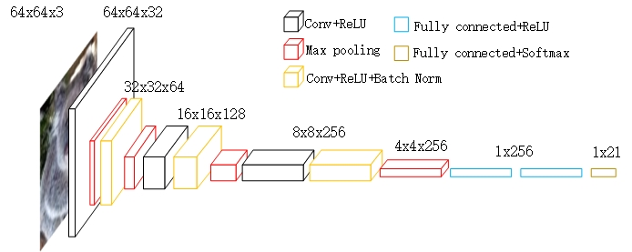

# Classification-convNet

## Description
In this project, we implement a neural network to predict the class labels of a given image without using any deep learning packages.

## Dataset
-  This dataset contains 10,000 images in total, which are divided into 20 classes (each class has 500 images). The class labels are as follows.

<table id="lectures">
<tr class="r1"><td class="c1">label index  </td><td class="c2"><b>1</b>       </td><td class="c3"><b>2</b>     </td><td class="c4"><b>3</b>    </td><td class="c5"><b>4</b>  </td><td class="c6"><b>5</b></td><td class="c7">  <b>6</b> </td><td class="c8">  <b>7</b></td><td class="c9">  <b>8</b></td><td class="c10">  <b>9</b></td><td class="c11">  <b>10</b></td><td class="c12">  <b>11</b></td><td class="c13">  <b>12</b></td><td class="c14">  <b>13</b></td><td class="c15">  <b>14</b></td><td class="c16">  <b>15</b></td><td class="c17">  <b>16</b></td><td class="c18">  <b>17</b></td><td class="c19">  <b>18</b></td><td class="c20">  <b>19</b></td><td class="c21">  <b>20</b> </td></tr>
<tr class="r2"><td class="c1">text description </td><td class="c2"> goldfish </td><td class="c3"> frog </td><td class="c4"> koala </td><td class="c5"> jellyfish </td><td class="c6"> penguin </td><td class="c7"> dog </td><td class="c8"> yak </td><td class="c9"> house </td><td class="c10"> bucket </td><td class="c11"> instrument </td><td class="c12"> nail </td><td class="c13"> fence </td><td class="c14"> cauliflower </td><td class="c15"> bell peper </td><td class="c16"> mushroom </td><td class="c17"> orange </td><td class="c18"> lemon </td><td class="c19"> banana </td><td class="c20"> coffee     </td><td class="c21">    beach            
</td></tr></table>

 

- The dataset is cultured from [the tiny ImageNet dataset](https://tiny-imagenet.herokuapp.com/). You may want to visit the source page for more details.
- All training images are color images, and each of them has 64 * 64 pixels. The size of the testing images is the same as the training images.

## The Classifier
- Input: an image.

- Output:  the confidence scores of all classes. If the input image is belong to one of the 20 classes, the confidence score corresponding to its true class is expected to be the largest one. Otherwise, the confidence score of a label “unknown” is supposed to be the largest one. Thus, we indeed have 21 class labels.

## The Performance Measure
- For each testing image, the classifier will output the top three class labels with the highest confidence scores. If the true class label is one of the top three labels, we will say the classifier has correctly predicted the class label of the input image; otherwise, the classifier made a mistake.

## Training
- In the actual training, we searched the Internet for 1000 64*64 RGB images as training materials for the unknown class.

- We choose six different structures and test their performance on this problem separately. These six structures are as follows. 

| structure1 | structure2 | structure3 | structure4 | structure5 | structure6 |
| :------:   | :------:  | :------:    | :------:   | :------:  | :------:    |
| 4-layers model | 6-layers model | residual model |VGG-like model 1 | VGG-like model 2 | VGG-like model 3 |
| conv_relu(32,3,3) max_pooling(2,2) fc(100) fc(21) |conv_relu_bn(32,5,5) max_pooling(2,2) conv_relu(64,3,3) conv_relu_bn(64,3,3) max_pooling(2,2) fc(128) fc(21) | conv_relu_bn(32,5,5) max_pooling(2,2) res_block res_block mmax_pooling(2,2) fc(256) fc(21) |conv_relu(32,3,3) max_pooling(2,2) conv_relu_bn(64,3,3) max_pooling(2,2) conv_relu(128,3,3) conv_relu_bn(128,3,3) max_pooling(2,2) conv_relu(256,3,3) conv_relu_bn(256,3,3) max_pooling(2,2) fc(256) fc(256) fc(21) |conv_relu(32,3,3) max_pooling(2,2) conv_relu_bn(64,3,3) max_pooling(2,2) conv_relu(128,3,3) conv_relu_bn(128,3,3) max_pooling(2,2) conv_relu(256,3,3) conv_relu_bn(256,3,3) max_pooling(2,2) fc(1024) fc(1024) fc(21) | conv_relu(64,3,3) max_pooling(2,2) conv_relu_bn(128,3,3) max_pooling(2,2) conv_relu(256,3,3) conv_relu_bn(256,3,3) max_pooling(2,2) conv_relu(512,3,3) conv_relu_bn(512,3,3) max_pooling(2,2) fc(1024) fc(1024) fc(21)|

- We trained 20 epochs on the training set with six different models and tested the accuracy of the model on the validation set after each epoch. We selected the best performance of 20 epochs as the best performance under one structure.

## Testing
- The test results are as follows.(The accuracy below is based on the top-3 criterion.)

| structure1 | structure2 | structure3 | structure4 | structure5 | structure6 |
| :------:   | :------:  | :------:    | :------:   | :------:  | :------:    |
| 4-layers model | 6-layers model | residual model |VGG-like model 1 | VGG-like model 2 | VGG-like model 3 |
| 0.715 | 0.724 | 0.753 | 0.835 | 0.768 | 0.807 |
- Based on the performance of the test, we chose VGG-like model 1 as our final model. Its forward propagation process is as follows.

